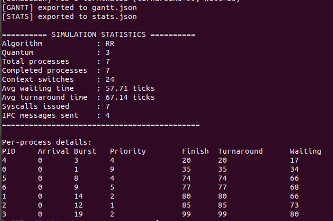
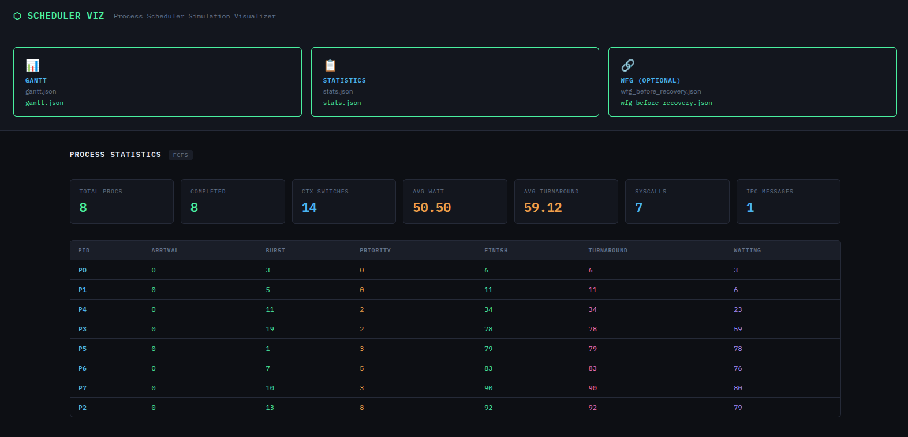
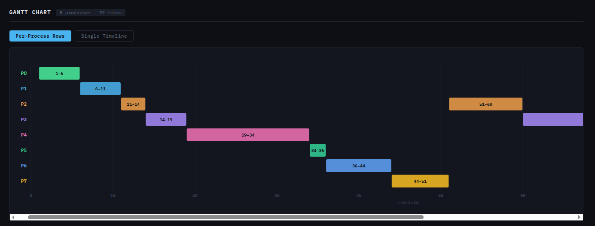
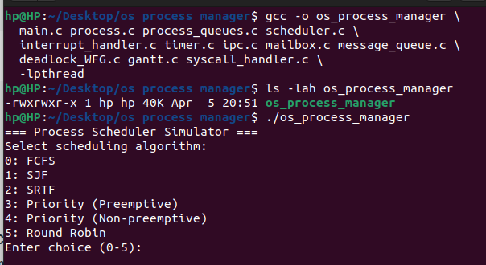

# OS Process Manager

# 🌟 Highlight

A process Manager in C presenting important os and system concepts and problems.

- IPC, Interrupts, and system calls - handling synchronous and asynchronous events
- cycle detection in a wait‑for graph with a simple recovery strategy
- Interactive visualizer – export simulation data to JSON and view Gantt charts, process stats, and wait‑for graphs in your browser

# ℹ️ Overview

The Process manager is encapsulated in a simple modular-based architecture, separated by responsiblity
over 25 source file.
This project simulates a process scheduler that manages process lifecycles, supports
multiple scheduling algorithms, handles interrupts and system calls, implements two IPC mechanisms,
and includes deadlock detection. It is built as a modular C program with separate components for queues,
scheduling logic, IPC, and more

### Main Features and Functionalities:

1. **Process lifecycle & scheduling** – supports 6 scheduling algorithms (FCFS, SJF, SRTF, Priority preemptive/non‑preemptive, Round Robin).
2. **Global timer tick** – drives time progression, preemptions, and wake‑ups.
3. **Interrupt handling** – timer interrupts (for Round Robin) and I/O completion interrupts are raised and processed via an interrupt queue.
4. **System calls** – simulated `SYS_IO`, `SYS_EXIT`, `SYS_SLEEP`, and `SYS_RECV`; can be randomly triggered during simulation.
5. **IPC mechanisms** – per‑process mailboxes (point‑to‑point) and a system‑wide message queue (broadcast / any‑to‑any)
6. **Deadlock detection & recovery** – builds a wait‑for graph from blocked processes, detects cycles, and recovers by terminating the lowest‑priority victim.
7. **Deadlock test program** – `main_test_deadlock.c` creates a circular wait to demonstrate detection and recovery.
8. **JSON export & web visualizer** – simulation results (Gantt chart, process statistics, wait‑for graph) are exported as JSON and can be viewed in a browser‑based dashboard.

### Run Examples







### some Design Choices

- **Single wait queue for both I/O and IPC blocking** — simplifies the scheduler tick
  loop; `wait_for` and `io_remaining` fields on the PCB distinguish the two cases.
- **WFG over RAG** — a Resource Allocation Graph requires tracking resource instances
  separately; since all blocking here is process-to-process (IPC), a simpler wait-for
  graph is sufficient and easier to extend.
- **Interrupt queue over direct calls** — raising an interrupt and processing it in the
  next tick decouples detection (in the tick loop) from handling (in the interrupt
  handler), mirroring how real hardware interrupts work.
- **Fixed-size mailbox, dynamic message queue** — mailbox models a single hardware
  register (one slot, blocks on full); the queue models a software buffer for
  broadcast/any-to-any messaging.

### Limitations

- Only single‑core simulation (no multi‑processor).
- No priority inheritance or advanced deadlock recovery (only victim termination).
- IPC is simulated without true parallelism.
- The visualizer is static (no live updates).
- Only a subset of possible system calls are implemented.

# ⚙️ Build & Run

**Requirements**

- C compiler (gcc/clang)
- CMake (optional, if you prefer using the provided CMakeLists.txt)
- pthread library (for the timer thread)

1. Run directly from IDE
2. Build and run with CMake

   ```cmake
   mkdir build && cd build
   cmake ..
   make
   ```

   ```cmake
   # From inside the build directory
   ./os_process_manager

   # Or from project root
   ./build/os_process_manager
   ```

   ```cmake
   #if a file already exits and not running
   rm -rf build
   mkdir build
   cd build
   cmake ..
   make
   ./os_process_manager
   ```

3. Build and Run manually with gcc

   

   ```c
   //compile from directory os_process_manager
   gcc -o os_process_manager *.c -lpthread
   // there are two main files so run exact files to compile
   gcc -o os_process_manager \
     main.c process.c process_queues.c scheduler.c \
     interrupt_handler.c timer.c ipc.c mailbox.c message_queue.c \
     deadlock_WFG.c gantt.c syscall_handler.c \
     -lpthread

   //verify it compiled
   ls -lah os_process_manager
   ```

   ```c
   ./os_process_manager
   ```

After running, look for the generated JSON files (`gantt.json`, `stats.json`, `wfg_before_recovery.json`). Open `index.html` in your browser and upload them to visualise the results.
**Tested on:**  Ubuntu 22.04 · Windows 11 — GCC/Clang/CMake, CLion IDE.
